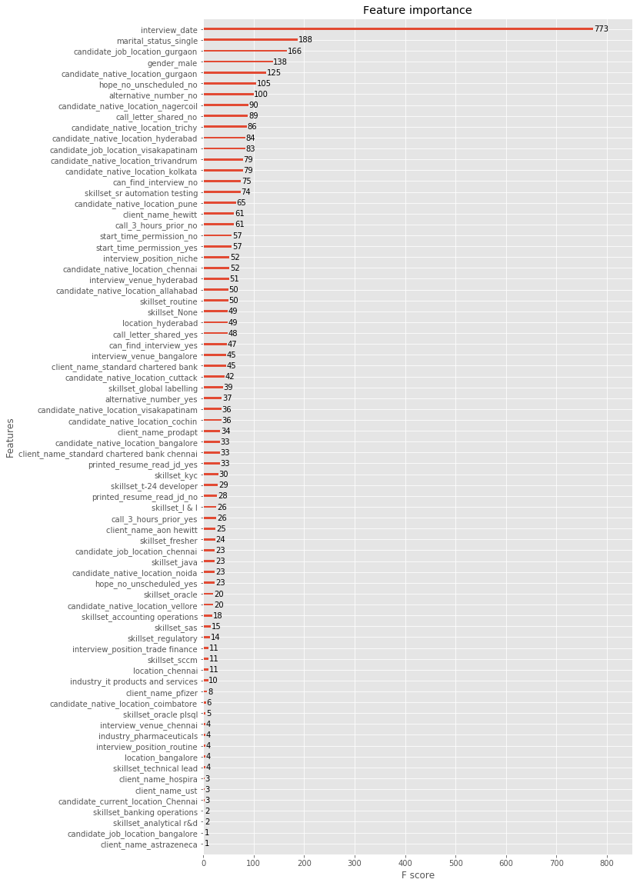
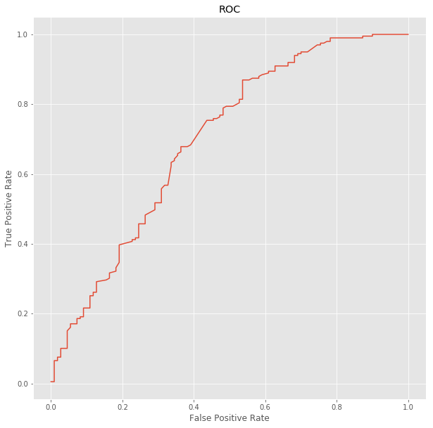
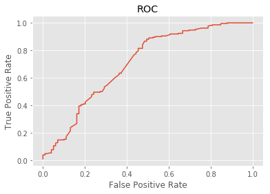

# Interview prediction case study
Predict whether interview applicants will actually show up for an interview.

Data is in the data folder.  This data is the subject of a Kaggle competition you can read about [here](https://www.kaggle.com/vishnusraghavan/the-interview-attendance-problem).  The data are more thoroughly described on the Kaggle website.

# Exploratory Data Analysis 
The dataset is comprised of 1234 rows of data with 22 categorical columns and one timestamp column that describe an instance of a scheduled interview or an unscheduled interview that occured. Columns included information about the company, role, location, basic application information, and a large number of free entry columns regarding scheduling and communication with the applicant.

Each column allowed for free-entry of values, which resulted in a large amount of data entry errors, and a large number of categories of answers for each feature. Additionally, the data also contains a number of missing values in specific columns, and a single row with missing value. Many of the entries in columns corresponding to applicant scheduling and communication had unusual entries that were not easily classifed.  Correcting these missing values proved to be challenging as each column required specific logic associated with how the missing or atypical-category values should be filled. After replacing these missing values, all data except the date of the interview were converted to dummy values for modeling.

# Modeling Approaches

We decided to split our efforts on different modeling approaches, including: Random Forest Classifiers, XGBoost Classifier, Logistic Regression, and Neural Networks.

Information about models...

# Model Performance

Performance of Random Forest (Andrew):

Performance of XGBoost Classifier (Kyle):
Creating a model with XGBoost was a fairly simple matter. Unfortunately, changing meta-parameters and feature selection only barely made a mark on the resulting accuracy, as it seems that the models default parameters were optimal, at least for this data set. I printed out a feature importance plot to spot any catagoricals that were relatively low, and was pretty useless.

The Roc curve shows that it wasn't necessarily a bad model, just not amazing.

Performance of Logistic Regression (Alyse):

While result of the Logistic Regression was not great when performed with all of our cleaned features except for the interview date, it did seem to be competive against some of the other model initial runs. The accuracy score was 71.5, the recall was 98.5, and the F1 score was 81.7. 
Below is the ROC curve for the initial Logistic Regression model:

I ran sklearn's Recursive Feature Estimation to try and identify some of the top features to use in the model. While the accuracy imporved slightly to 72.8, the recall lowered significantly to 82.7, and the F1 to 79.9.

Below is the ROC curve for the Logistic Regression only using a subset of feautures identified through Recursive Feature Estimation:

Performance of Neural Network (Jarred):

# Results and Conclusions

