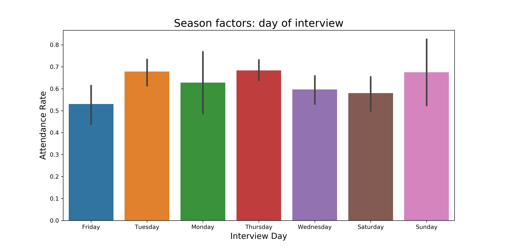

# Interview prediction case study
Predict whether interview applicants will actually show up for an interview.

Data is in the data folder.  This data is the subject of a Kaggle competition you can read about [here](https://www.kaggle.com/vishnusraghavan/the-interview-attendance-problem).  The data are more thoroughly described on the Kaggle website.

# Exploratory Data Analysis 
The dataset is comprised of 1234 rows of data with 22 categorical columns and one timestamp column that describe an instance of a scheduled interview or an unscheduled interview that occured. Columns included information about the company, role, location, basic application information, and a large number of free entry columns regarding scheduling and communication with the applicant.

Each column allowed for free-entry of values, which resulted in a large amount of data entry errors, and a large number of categories of answers for each feature. Additionally, the data also contains a number of missing values in specific columns, and a single row with missing value. Many of the entries in columns corresponding to applicant scheduling and communication had unusual entries that were not easily classifed.  Correcting these missing values proved to be challenging as each column required specific logic associated with how the missing or atypical-category values should be filled. After replacing these missing values, all data except the date of the interview were converted to dummy values for modeling.

The dataset comprises information about job interviews across cities in India from 2001 onwards, with general information about candidates, interview date, and information about the interview. Many of the columns contain unusual text entries, and are associated with communication with the candiate for specific steps in the process.

Seasonal factors appear to have some impact on the results, but spare data points across some dates make it less valuable as a predictor.

Day of the week and month of the year may have some values as an engineered feature for parametrics models.

  

Information about the employer and job opening also provide some potential features for use in modeling. The variance is quite high, but there may be value in its use.

 

# Modeling Approaches

Our group decided to split our efforts on different modeling approaches, including both parametrics and non-parametric methods: Random Forest Classifiers, XGBoost Classifier, Logistic Regression, and Neural Networks.

# Model Performance

### Ultimately, the performance of the models were similar between the different approaches, but not particularly strong as measured by the prediction accuracy.

#### Performance of Random Forest:
Creating a Random Forest model is fairly straight-forward with minimal hyperparameter tuning required. Given the time contraints, this was the best Random Forest model produced.
Approach: use top 30 feature importance for modeling.

**Best Accuracy: ~70%**

#### Performance of XGBoost Classifier:
Creating a model with XGBoost was a fairly simple matter, but hyper-parameters tuning and feature selection had minimal impact on accuracy, as it seems that the models default parameters were optimal. Feature importance plot to spot any catagoricals that were relatively low, and was not of much value.

**Best Accuracy: 71%**

The Roc curve shows that it wasn't necessarily a bad model, but did not perform strongly.

#### Performance of Logistic Regression:
A LASSO Logistic Regression was used to reduce the feature set. 

**Best accuracy: 73**

Below is the ROC curve for the initial Logistic Regression model:

Below is the ROC curve for the Logistic Regression only using a subset of feautures identified through Recursive Feature Estimation:

#### Performance of Neural Network:
Research on appropriate Neural Network architecture for this type of project suggested a simple two approach with only two layers. Hyper-parameter tuning yielded some improvement in model performance, but more advanced structures did not improve model peformance.

**Best accuracy: 74%**

# Results and Conclusions
The performance of all models was very similar, but not strong in any case. Given the poor overall performance, a model that provides some interpretability (either parametrics or non-parametric) is preferable. However, given the relatively low accuracy of each model, the predictions on feature importance are not given with a high degree of confidence. 

Interview date appeared as an important feature, but this is problematic because of spare and biased date in some areas which make it challenging to use as a predictor. Marital Status, gender, and candidatate location also impact the predictions. Ultimately, the impact of any individual feature was low, and given the poor overall performance there are not strong conclusions to be made about impact of particular features.

Given additional time, these result may have been improved via additional feature engineering. But it appears the the given features do not rapid development of a model with high predictive power.

